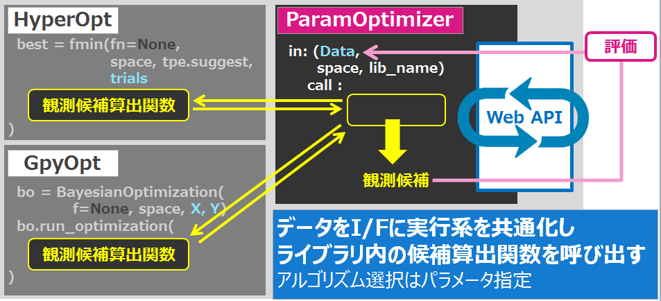

# ParamOptimizer

## Purpose
+ 複数のパラメータ最適化アルゴリズムをJsonを用いたWeb APIで使用可能
+ 実行時イメージは下図。オプティマイズループが実行ライブラリの外側へ来る
+ そのため、関数に出来ないような対象も最適化アルゴリズムで実行することができる


## Requirements
hyperoptが新しいnetworkxに対応していないため、古いVersionをインストールする必要があります（2018/3現在）
+ networkx 1.11
+ hyperopt 0.1
+ GPy 1.8.5
+ GPyOpt 1.2.1
+ Flask 0.12.2

## Contain Algorithms
### hypoeropt
+ Tree-structured Parzen Estimator
+ Annealing
+ Random Search

### gpyopt (Bayesian Optimization)
#### models
+ GP
+ GP_MCMC
+ Sparse GP

#### aquisitions
+ EI
+ MPI
+ LCB

## Web API I/F

|GET|
|:---|
|Tutorial参照|

|POSTデータ(JSON)||||||
|:---|:---|:---|:---|:---|:---|
|JSON Key|型|必須|概要|ライブラリ依存||
|seed|数値||乱数シード　再現性確認用||
|lib|文字列|◯|ライブラリ名||
|algo|文字列|◯|ライブラリが持つアルゴリズム選択|◯|
|scope|配列[オブジェクト]|◯|探索空間定義||
|scope - 変数名|オブジェクト|◯|探索空間定義|◯|
|max_evals|数値||応答数指定||
|results|オブジェクト||過去実行結果||
|results - losses|配列||目標値履歴||
|results - statuses|配列||状態値(未使用)||
|results - vals|オブジェクト||実行パラメータ履歴||
|results - vals - 変数名|配列||scopeで定義した変数名毎の実効値|||


|返却データ(JSON)|||
|:---|:-:|:---|
|JSON Key|型|概要|
|vals|オブジェクト|推奨パラメータ|
|vals - 変数名|オブジェクト|scopeで定義した変数名毎の推奨値|
|statuses|配列|ステータス文字列(現状"new"固定)|


### hyperopt依存部
+ algo
  + tpe
  + anneal
  + rand
  + mix
+ uniform
        "scope": [
          {ラベル名: [uniform, 下限値, 上限値]}
        ]
+ quniform
        "scope": [
          {ラベル名: [quniform, 下限値, 上限値, 分解能]}
        ]
      戻り値はround(uniform(low, high) / q) * q
+ choice
        "scope": [
          {ラベル名: [choice, 選択A, 選択B, ...]}
        ]

[その他](https://github.com/hyperopt/hyperopt/wiki/FMin)

### gpyopt依存部
+ algo
  + GP,EI
  + GP,MPI
  + GP,LCB
  + GP_MCMC,EI_MCMC
  + GP_MCMC,MPI_MCMC
  + GP_MCMC,LCB_MCMC
  + sparseGP,EI
  + sparseGP,MPI
  + sparseGP,LCB
+ continuous
        "scope": [
          {ラベル名: [continuous, 下限値, 上限値]}
        ]
+ discrete
        "scope": [
          {ラベル名: [discrete, a, b, c]}
        ]
+ categorical

[その他](http://sheffieldml.github.io/GPyOpt/tutorial/index.html)


## Tutorial
*Web service起動*
```
python param_opt_web.py
```
*Optimize 実行*
```
http://127.0.0.1:5000/suggest?condition={"seed":0,"lib":"hyperopt","algo":"rand","scope":[{"x":["uniform",-10,10]},{"y":["uniform",-10,10]}],"max_evals":3,"results":{"losses":[],"statuses":[],"vals":{"y":[], "x":[]}}}
```

## LICENSE
[hyperopt](https://github.com/hyperopt/hyperopt/blob/master/LICENSE.txt)
[gpyopt](https://github.com/SheffieldML/GPyOpt/blob/master/LICENSE.txt)
